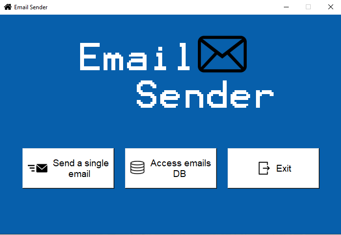
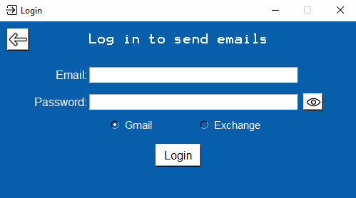
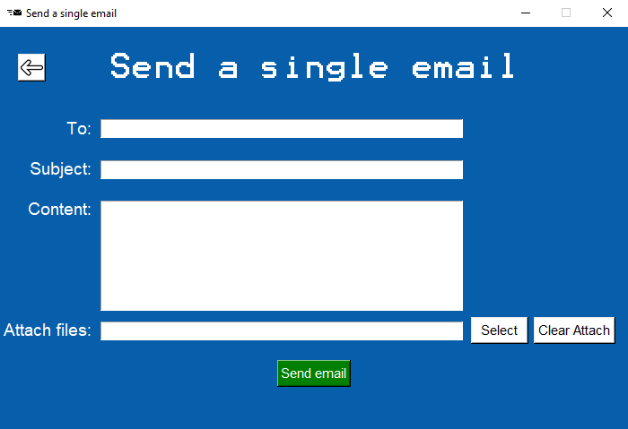
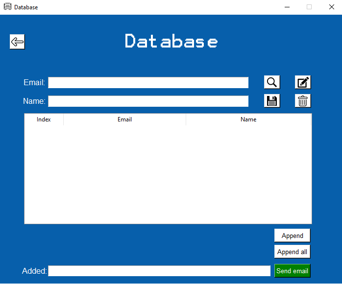

# :email: Email Sender
Send emails with attachments and store email addresses with SQLite DB

:heavy_check_mark: Interfaces  
:heavy_check_mark: Database  
:heavy_check_mark: Attachments  
:heavy_check_mark: SMTP mailing  
:heavy_check_mark: Exchange mailing  
:x: Run on Linux  
---
  
  
## :heavy_exclamation_mark: Important requirements: :heavy_exclamation_mark:
##### 1. You must have Python 3 installed, if you haven't installed yet, check [this tutorial](https://realpython.com/installing-python/#windows)!

##### 2. Make sure to click in "Add Python 3.x to PATH" in installation.

##### 3. Make sure pip is installed:
- On terminal: `pip` - Some commands and informations should appear

##### 4. Install Pillow
- On terminal: `pip install pillow` - Wait until installation is complete
---
  
  
## :rocket: Running the code

#### 1. Clone this repository or download the ZIP.

#### 2. Run the code.
- On terminal: `python main.py`
---
  
  
## :book: Using the email sender

### Send a single email
- You have to log into your Gmail or MS Exchange account
- For MS Exchange accounts, exchange server address is required. If you don't know how to do that, [check this](https://www.nucleustechnologies.com/blog/how-to-find-exchange-server-address/)
- Send your email

### Database
- You can search for, save, edit and delete email addresses in the database.
- Each registered email has its random unique ID.
- You can send email to multiple email addresses by selecting the register and clicking in the button to append it.

